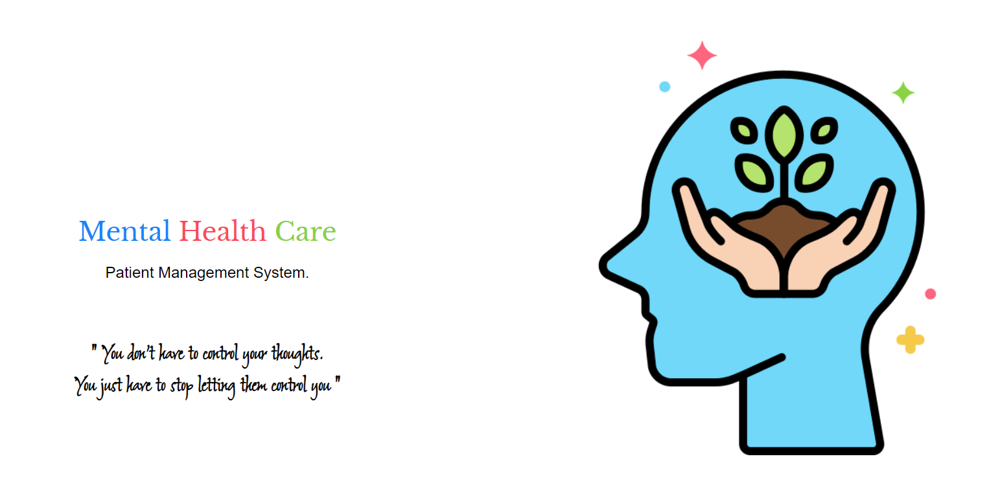

<p align="center"> Server for MHC-PMS project </p>
  
### Link to Project
Mental Health Care - Patient Management System ([MHC-PMS](https://github.com/SandeepKrSuman/mhc-pms))  
  
### Spin the server
```
npm i && npm start
```
- Keep the server running in development using [nodemon](https://www.npmjs.com/package/nodemon)

```
npm run dev
```
from zhang present 16/11
